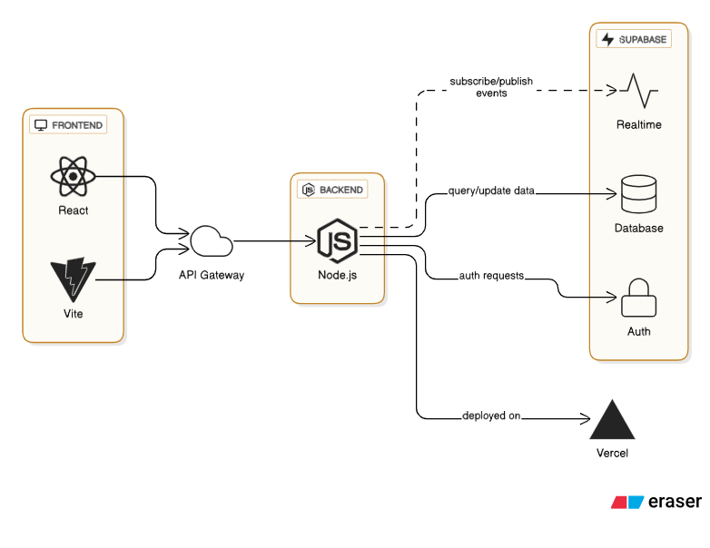

# MagsD Jewelry — Frontend (Vite + React)

This repo is a Vite + React frontend wired to Supabase for auth. It includes:

- Landing/Home page with image placeholders
- Header and Footer components
- Login / Register (email + Google) with show-password UI
- Admin dashboard (user management) and a serverless admin endpoint for Vercel

---

## Quickstart (local)

1. Install dependencies:

```powershell
npm install
```

2. Run the dev server:

```powershell
npm run dev
```

3. Open http://localhost:5173 (Vite default) and test pages.

Notes: Tailwind is already configured; `src/index.css` contains Tailwind directives.

---

## Environment variables (Vercel / Production)

Set these in Vercel Project > Settings > Environment Variables (or in your server environment):

- `SUPABASE_URL` — your Supabase project URL (e.g. https://xyz.supabase.co)
- `SUPABASE_SERVICE_ROLE` — Supabase service_role key (server-only, DO NOT expose to client)
- `ADMIN_SECRET` — a random secret used to protect the serverless admin endpoint

The frontend uses the anon key (`src/services/supabaseClient.js`) for normal client auth. The serverless function uses `SUPABASE_SERVICE_ROLE` to list/manage users.

---

## Deploying to Vercel

1. Connect this GitHub repository to Vercel.
2. Add the environment variables listed above in the Vercel project settings.
3. Deploy — Vercel will build and publish the app. The admin endpoint will be available at:

```
https://<your-vercel-domain>/api/admin/list-users
```

Call the endpoint with header `x-admin-secret: <ADMIN_SECRET>`.

---

## Testing the admin endpoint locally

For quick local testing (NOT for production):

1. Set `ADMIN_SECRET` in your local environment or `vercel dev` environment.
2. You can also set `window.__ADMIN_SECRET__ = '<ADMIN_SECRET>'` in the browser console for manual testing; then open `/dashboard`.

Important: do not commit secrets to source control.

---

## Security notes

- Never expose `SUPABASE_SERVICE_ROLE` in client code. Use serverless functions or a backend to perform privileged actions.
- Protect admin endpoints with a strong secret and, ideally, server-side admin authentication.

---

## Pushing & CI

- Repo is already connected to GitHub. To push local changes:

```powershell
git add .
git commit -m "Describe changes"
git push
```

Vercel will automatically deploy on push to the connected branch.

---

If you want, I can:
- Add a small in-app prompt to enter the admin secret (keeps it in-memory only)
- Add serverless endpoints for user delete/revoke so dashboard actions work securely
- Create a short README section with recommended RBAC and admin setup for Supabase

Tell me which next step you prefer.
# Item images (URL or Upload)

Admins can paste an image URL or upload an image directly in the Items tab. Uploads go to a Supabase Storage bucket `item-images`, and the app uses its public URL.

Run this in Supabase SQL Editor to create the bucket and basic policies:

```
-- Create a public bucket for item images
select storage.create_bucket('item-images', public := true);

-- Public read for the bucket
create policy if not exists "Public read item-images"
on storage.objects for select
to public using ( bucket_id = 'item-images' );

-- Authenticated users can upload to the bucket
create policy if not exists "Authenticated can upload item-images"
on storage.objects for insert
to authenticated with check ( bucket_id = 'item-images' );

-- Optional: allow owner updates; not strictly needed for this app
create policy if not exists "Authenticated can update own item-images"
on storage.objects for update
to authenticated using ( bucket_id = 'item-images' and owner = auth.uid() )
with check ( bucket_id = 'item-images' and owner = auth.uid() );
```

Note: Ensure the bucket is public so `getPublicUrl` returns a usable URL.
# React + Vite

This template provides a minimal setup to get React working in Vite with HMR and some ESLint rules.

Currently, two official plugins are available:

- [@vitejs/plugin-react](https://github.com/vitejs/vite-plugin-react/blob/main/packages/plugin-react) uses [Babel](https://babeljs.io/) for Fast Refresh
- [@vitejs/plugin-react-swc](https://github.com/vitejs/vite-plugin-react/blob/main/packages/plugin-react-swc) uses [SWC](https://swc.rs/) for Fast Refresh

## Expanding the ESLint configuration

If you are developing a production application, we recommend using TypeScript with type-aware lint rules enabled. Check out the [TS template](https://github.com/vitejs/vite/tree/main/packages/create-vite/template-react-ts) for information on how to integrate TypeScript and [`typescript-eslint`](https://typescript-eslint.io) in your project.
# React-Vite-Supabase-Test


## Tech Stack Used
- React / React.js
- Node.js
- Vite
- Tailwind css 
- Supabase
- Vercel

### React / React.js
- Main component of the framework of the build
- used to build UI
- Component-based 

### Node.js
- Cross-platform runtime environment
- Used to run javascript outside the web browser
- Can provide scalability 

### Vite
- Used for frontend tooling
- Faster and more streamlined development experience
- Key features include instant server start and out-of-the-box support for JSX, TypeScript and CSS

### Tailwind CSS
- Utility-first CSS framework

### Supabase
- open-source Firebase alternative that provides a suite of backend services
- Handles Database, Storage and Aunthentication

### Vercel
- Cloud platform for deploying and scaling web apps
- Key features include automatic delivery and global content delivery


## Tech Stack Diagram

